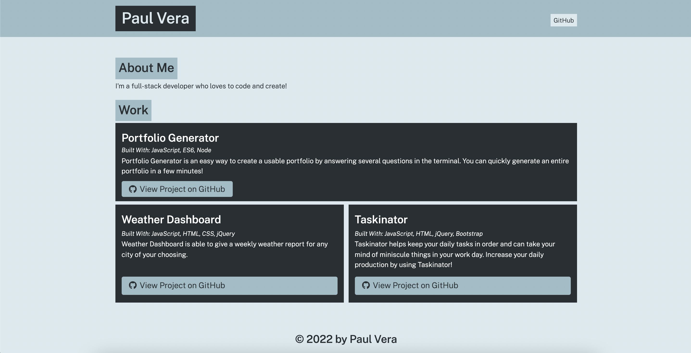

# portfolio-generator

## Purpose
Portfolio Generator is an easy way to create a usable portfolio by answering several questions in the terminal. You can quickly generate an entire portfolio in used a few minutes.

## Built With
* JavaScript
* ES6
* Node

## Website
https://paul88vera.github.io/portfolio-generator/

## Contribution
Made with ❤️ by [Paul Vera]